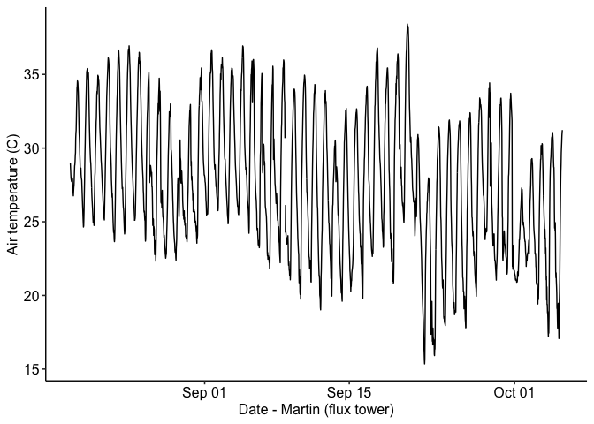
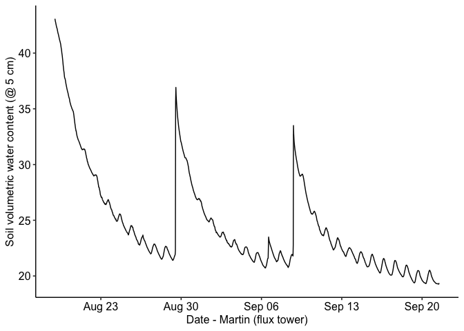
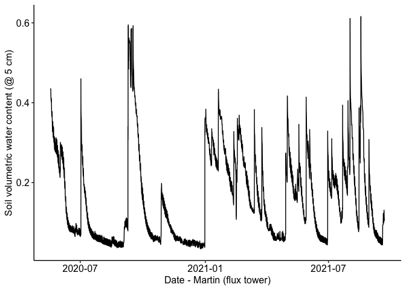
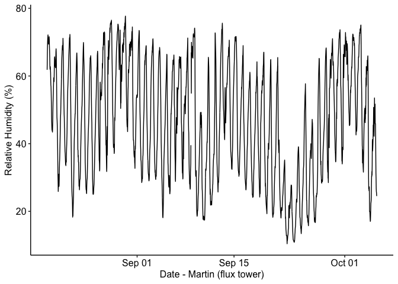

Martin Ranch flux tower data
================

### Location: 30.8167, -99.8619

### Texas A&M University

### Summary plots:

Half-hourly data from 2021-08-19 to 2021-10-05 15:00:00

<!-- --><!-- --><!-- --><!-- -->
