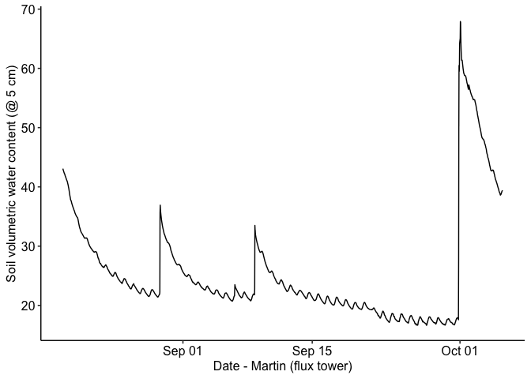
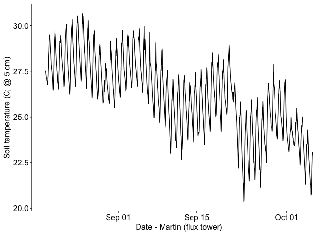

Martin Ranch flux tower data
================

### Location: 30.8167, -99.8619

### Texas A&M University

    ## 
    ## Attaching package: 'lubridate'

    ## The following objects are masked from 'package:data.table':
    ## 
    ##     hour, isoweek, mday, minute, month, quarter, second, wday, week,
    ##     yday, year

    ## The following objects are masked from 'package:base':
    ## 
    ##     date, intersect, setdiff, union

    ## 
    ## Attaching package: 'plyr'

    ## The following object is masked from 'package:ggpubr':
    ## 
    ##     mutate

### Summary plots:

Half-hourly data from 2020-05-18 11:30:00 to 2021-09-21 09:30:00

<!-- --><!-- --><!-- --><!-- --><!-- -->
