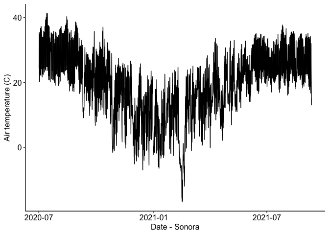
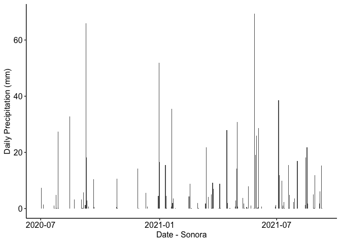
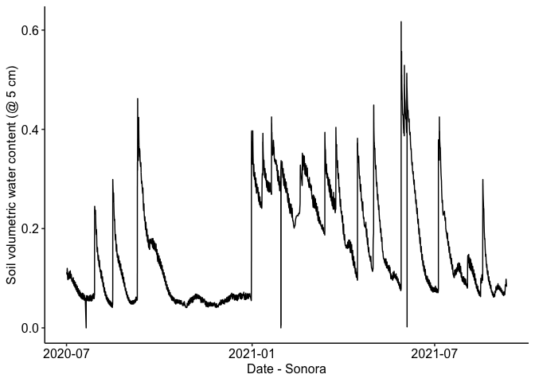
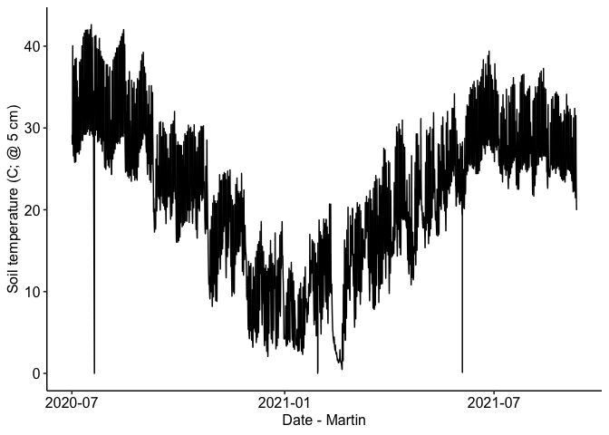
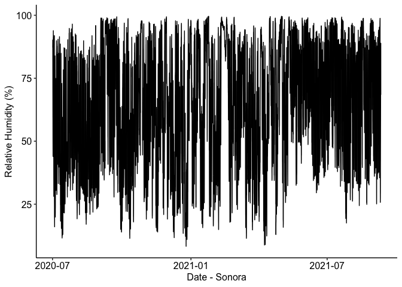

Martin weather station data
================

### Location: 30.8167, -99.8619

### Texas A&M University

### Summary plots:

Half-hourly data from 2020-07-01 05:00:00 to 2021-09-10 08:30:00

<!-- --><!-- --><!-- --><!-- --><!-- -->
