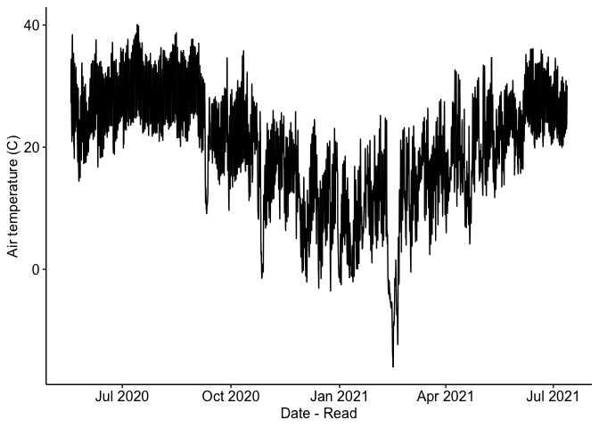
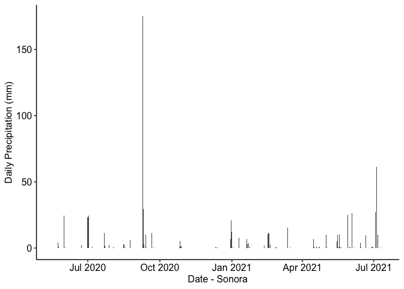
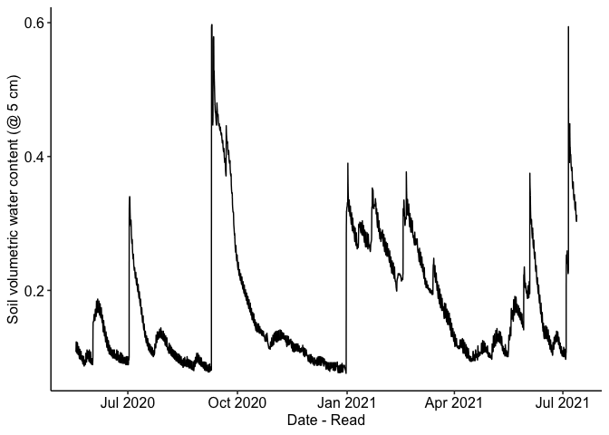
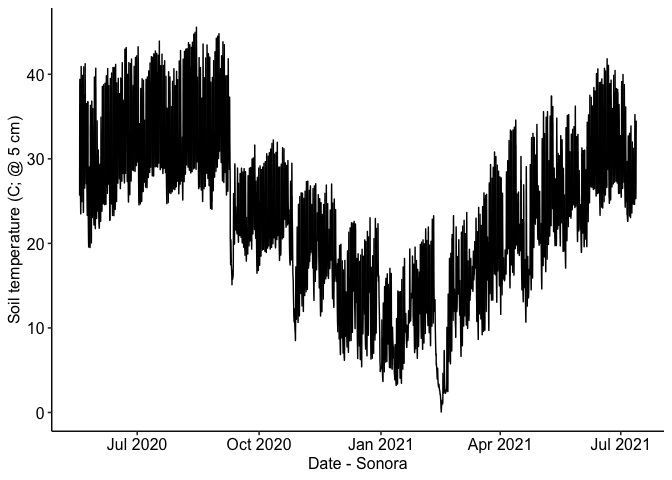
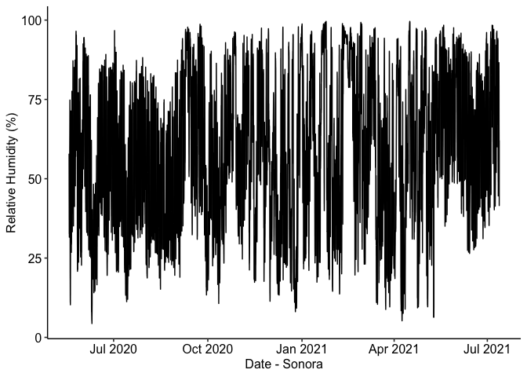

Read weather station data
================

### Location: 30.5431, -101.0488

### Texas A&M University

### Summary plots:

Half-hourly data from 2020-05-18 11:30:00 to 2021-07-12 15:30:00

<!-- --><!-- --><!-- --><!-- --><!-- -->
