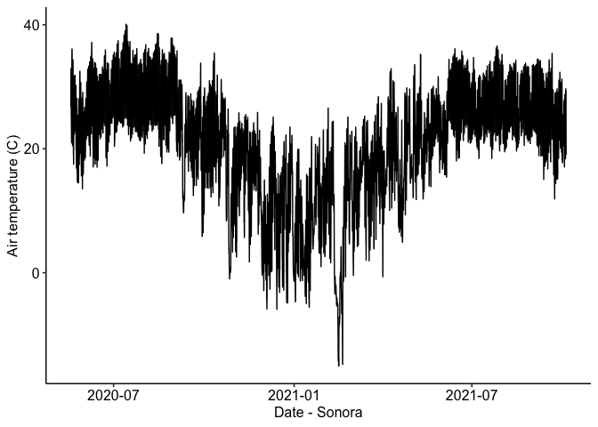
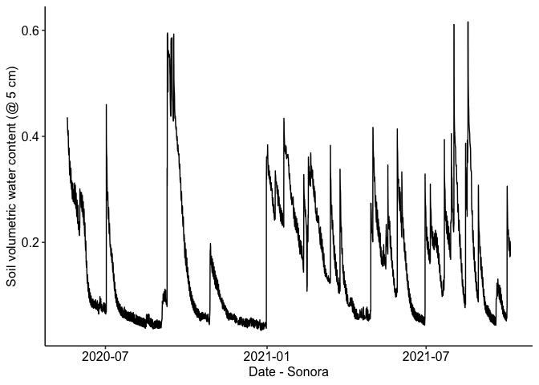
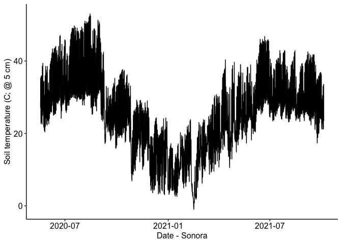

Sonora weather station data
================

### Location: 30.2568, -100.5811

### Texas A&M University

### Summary plots:

Half-hourly data from 2020-05-18 11:30:00 to 2021-09-13 13:00:00

<!-- --><!-- --><!-- --><!-- --><!-- -->
